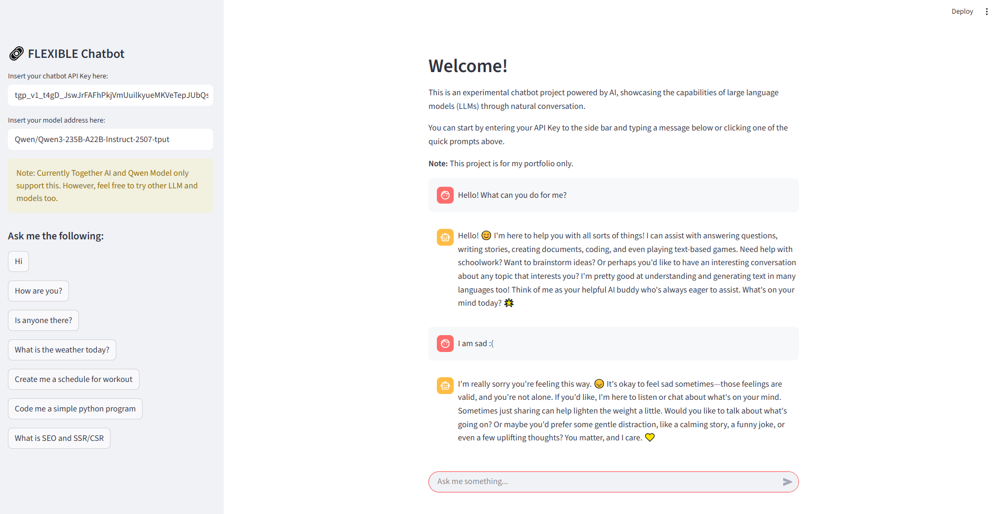

# 🔗 FLEXIBLE AI Chatbot

This is an experimental chatbot project powered by AI, showcasing the capabilities of large language models (LLMs) through natural conversation.

 <!-- Make sure this image exists in your repo -->

---

## 💡 Features

- Chat interface with message streaming
- Handles multiple prompts & responses
- Add your own API key and Model Address
- Supports error messages using `st.error()`
- Built using `Streamlit`

---


```bash
git clone https://github.com/your-username/your-repo.git
cd your-repo
